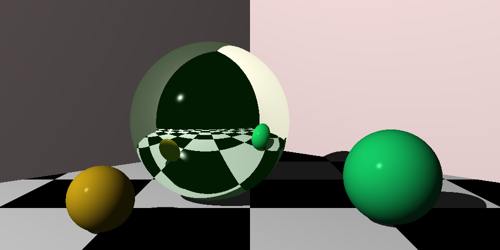

# The Ray Tracer Challenge

Brice's attempt at the ray tracer challenge in Go

## Chapters

### Chapter 11 – Reflection adn Refeaction



### Chapter 10 – Shaders


### Chapter 9 – Planes


### Chapter 8 – Shadows


### Chapter 7 – Scenes


### Chapter 6 – Lighting


### Chapter 5 – Object Transforms


### Chapter 4 – Transform Matrices


## Notes

You can use [the Open Asset Importer (assimp)](https://github.com/assimp/assimp) to convert `.stl` files to `.obj` files.

It's available on Mac via [homebrew](https://brew.sh/). (`brew install assimp`)

```bash
$ assimp export Model.stl Model.obj
```

## TODO

- [ ] Named entities and scene search
- [ ] Parallelise rendering across mutliple threads
- [ ] Profile and optimise rendering function
- [ ] Orbit movement function
- [ ] UV Mapping for textures
- [ ] Optimise shaders with raw values types
- [x] Progress indicator on render
- [x] Refactor Lights to be entities (so that they have a transform, potision, etc...)